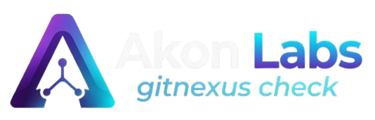
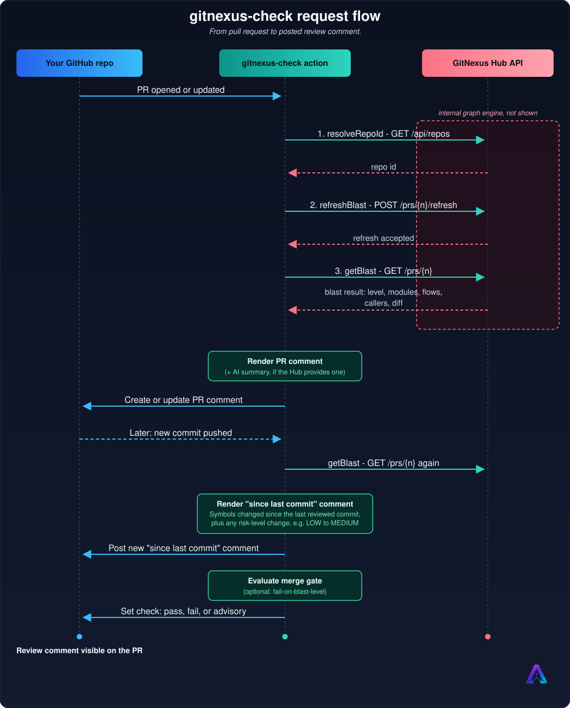
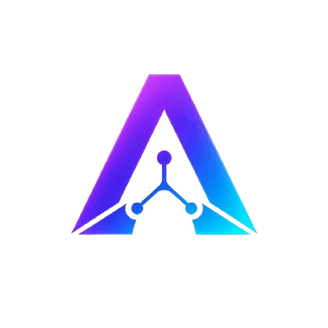

<div align="center">



[](LICENSE)
[](https://discord.gg/SrEf6KXjA)

**Deterministic pull request reviews powered by graph intelligence, not guesswork.**

</div>

---

## What it is

`gitnexus-check` gives every pull request a precise, data backed review instead of a
guess. It runs against the GitNexus Hub, an enterprise knowledge graph of your codebase
built from parsed symbols, call chains, and dependency relationships, so it knows
exactly what a change touches and who depends on it before your team has to find out the
hard way. The comment updates in place as new commits land, so the review is always
current.

Requires a GitNexus Hub account and a `GNX_TOKEN`.

[](https://akonlabs.com)

## What you get in the comment

Every section below is computed from the graph, not guessed by a language model:

- **Verdict headline**: the blast level plus a one-line reason (dependent-symbol count,
  modules touched, flows affected, and a "review carefully" note when the level is high).
- **Blast level**: `LOW`, `MEDIUM`, `HIGH`, or `CRITICAL`.
- **Architecture impact**: which modules of your codebase are touched, ranked by hit count.
- **Affected flows**: the execution flows the change reaches, ranked by hits.
- **Blast radius**: direct, indirect, and transitive callers of the symbols you changed.
- **Symbol changes**: every function, class, or type the PR adds, modifies, or removes.
- **API surface**: routes, exports, and signatures that moved.
- **Changed files**: every file in the diff with its status (added, modified, removed).
- **File risk**: non-graph files (migrations, CI, infra, config) flagged by risk category.

Sections only render when they have data. A docs-only PR won't show a Blast Radius table.

> [!NOTE]
> When enabled on the Hub, the comment leads with a short AI generated summary, with the
> full graph based report collapsed underneath.
>
> No extra setup on your end. It just appears once the Hub has it turned on.

## Quick Start

### 1. Install the CLI and link your account

```bash
npm install -g gitnexushub
gnx connect {GNX_TOKEN}
```

Generate `GNX_TOKEN` from your profile at [akonlabs.com](https://akonlabs.com).

> [!NOTE]
> `gnx connect` saves the token locally.
>
> With `--editor cursor|windsurf|claude-code|opencode`, it can also wire up MCP for your
> local coding assistant. That part is optional and separate from CI setup.

### 2. Index your repo

Your repo needs to be indexed on the GitNexus Hub before this action can review anything.
Do it through the web UI at [app.akonlabs.com](https://app.akonlabs.com/), or from the CLI:

```bash
gnx index owner/repo
```

### 3. Set up the workflow

**Automated (recommended):** from inside your repo, with the [GitHub CLI](https://cli.github.com/)
(`gh`) installed and authenticated:

```bash
gnx install-ci
```

This detects your repo, mints a CI token, and opens a pull request that adds
`.github/workflows/gitnexus.yml` and sets the required repo secret for you. Review and merge
the PR to enable it.

**Manual:** if you'd rather not use `gh`, add the secret and workflow file yourself.

Add `GNX_TOKEN` as a repo secret:

**Settings → Secrets and variables → Actions → New repository secret**

Then create `.github/workflows/gitnexus.yml`:

```yaml
name: GitNexus

on:
  pull_request:
    types: [opened, synchronize, reopened]

permissions:
  contents: read
  pull-requests: write

jobs:
  review:
    runs-on: ubuntu-latest
    steps:
      - uses: Akon-Labs/gitnexus-check@release
        with:
          hub-url: https://gitnexus-enterprise-staging.up.railway.app
          token: ${{ secrets.GNX_TOKEN }}
```

Open a PR and the comment shows up.

## Configuration

### Inputs

| Input | Required | Default | Description |
|-------|----------|---------|-------------|
| `hub-url` | yes | none | GitNexus Hub base URL (e.g. `https://app.akonlabs.com`). |
| `token` | yes | none | GitNexus CI token (`gnx_...`). Store as a repo secret. |
| `github-token` | no | `${{ github.token }}` | Token used to post the PR comment. |
| `fail-on-blast-level` | no | `''` (off) | Optional merge gate. See below. |

### Outputs

| Output | Description |
|--------|-------------|
| `comment-id` | The GitHub comment id created or updated. |
| `blast-level` | The PR blast level: `LOW`, `MEDIUM`, `HIGH`, or `CRITICAL`. |
| `gate-decision` | `pass`, `fail`, or `neutral`. `neutral` means advisory (no gate set). |

### The merge gate (`fail-on-blast-level`)

By default the action is advisory. It always posts the comment and the check stays green.
Set `fail-on-blast-level` to turn it into a gate that fails the workflow when the PR's
blast level meets or exceeds your threshold. The comment is always posted first, so a red
check always has an explanation attached.

```yaml
- uses: Akon-Labs/gitnexus-check@release
  with:
    hub-url: https://gitnexus-enterprise-staging.up.railway.app
    token: ${{ secrets.GNX_TOKEN }}
    fail-on-blast-level: CRITICAL   # block only on CRITICAL, omit for advisory
```

Threshold is meets-or-exceeds: `fail-on-blast-level: HIGH` fails on both `HIGH` and
`CRITICAL`. Accepted values are `LOW`, `MEDIUM`, `HIGH`, `CRITICAL` (case-sensitive). An
empty value keeps the action advisory.

> [!NOTE]
> To make the gate block merges, mark the GitNexus check as required in your branch
> protection rules (**Settings → Branches → Branch protection rules**).

## How it works

<div align="center">

</div>

The action itself is a thin client. It opens a PR event, makes three calls to the Hub,
renders the result, and posts the comment. All the graph analysis happens on the Hub side
and isn't shown here.

## Support

Found a bug or need help? Open an issue on this repo, or reach out at
[akonlabs.com](https://akonlabs.com).

## Contributing

Raise an issue first, fork the repo, then open a pull request from your fork into the
`dev` branch. See [CONTRIBUTING.md](CONTRIBUTING.md) for details.

## License

MIT. See [LICENSE](LICENSE).

<div align="center">



Made by [Akon Labs](https://akonlabs.com).
Built on [GitNexus](https://akonlabs.com).

</div>
